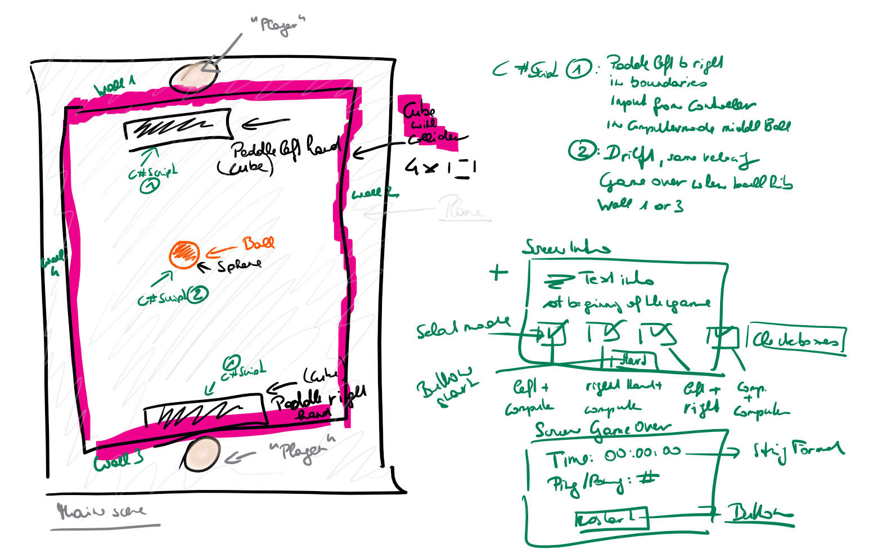

# inclass-steamVRInteractions

This is a second project to get used to develop applications for high immersion platforms like Oculus & Vive with Unity. 
For this interaction part I followed the instructions according to this tutorial: https://medium.com/@MrsDragos/virtual-reality-interactions-with-steamvr-ead59df686d7

Development platform: Windows 10, Unity Version 2017.3.15f3 (recommended by VRND), 
Visual Studio Community 2017 v 15.9.3, SteamVR Plugin (version 2.2.0); 

Target platform is Oculus Rift. 

In the tutorial a pong game will be developed. 

start Refactoring Test Case: Build floor with intact bricks; setting the bricks in first column consecutively (0,0), (0,1), (0,2) to Broken and subsequent to Destroyed; Spawn Repair Bricks only in first colunm. Result, all floor bricks have at the end the state intact, the repair bricks have been stacked.